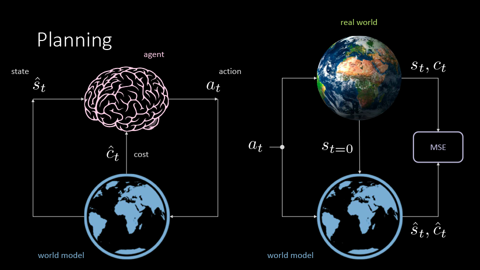
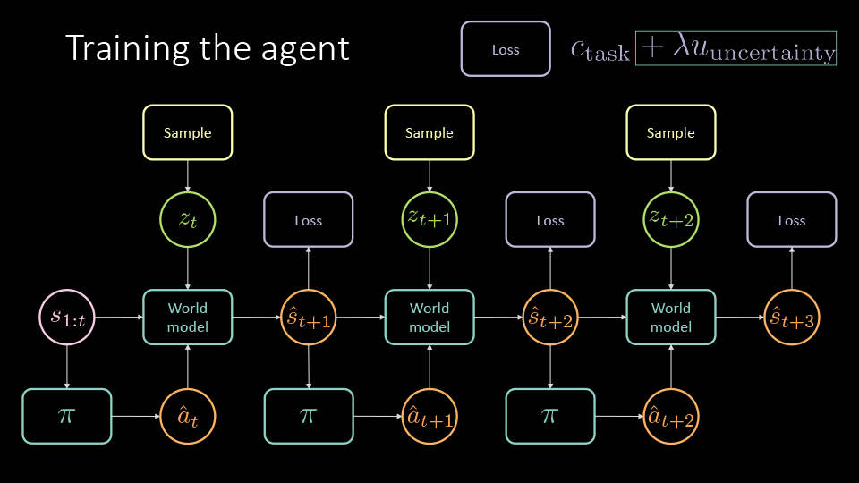
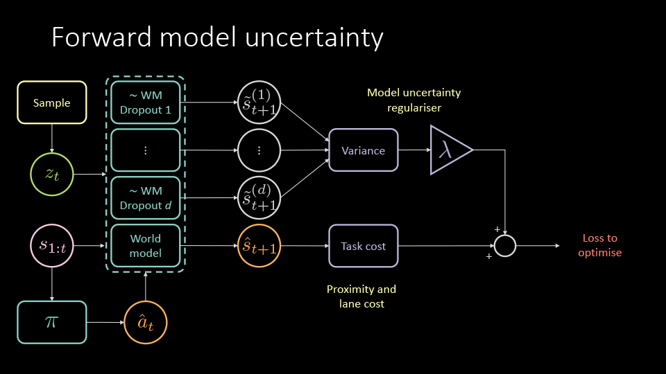

# Prediction and Policy-learning Under Uncertainty (PPUU)
[Gitter chatroom](http://gitter.im/PPUU), [video summary](http://youtu.be/X2s7gy3wIYw), [slides](http://bit.ly/PPUU-slides), [poster](http://bit.ly/PPUU-poster), [website](http://bit.ly/PPUU-web).  
Implementing [Model-Predictive Policy Learning with Uncertainty Regularization for Driving in Dense Traffic](http://bit.ly/PPUU-article) in [PyTorch](https://pytorch.org).



The objective is to train an *agent* (pink brain drawing) who's going to plan its own trajectory in a densely (stochastic) traffic highway.
To do so, it minimises a few costs over trajectories unrolled while interacting with a *world model* (blue world drawing).
We need to start, then, by training the *world model* with observational data from the real world (Earth's photo), which needs to be downloaded from the Internet.

## Getting the real data

To get started, you need to fetch the real world data.
Go to this [address](http://bit.ly/PPUU-data), and download the TGZ file (330 MB) on your machine.
Open a terminal, go to the location where you've downloaded the file, and type:

```bash
tar xf xy-trajectories.tgz
```

This will expand the NGSIM (Next Generation Simulation) data set compressed archive, consisting of all cars trajectories for the 4 available maps (now 1.6 GB).
Its content is the following:

```bash
xy-trajectories
├── i80
│   ├── trajectories-0400-0415.txt
│   ├── trajectories-0500-0515.txt
│   ├── trajectories-0515-0530.txt
│   └── trajectory-data-dictionary.htm
├── lanker
│   ├── trajectories-0830am-0845am.txt
│   ├── trajectories-0845am-0900am.txt
│   └── trajectory-data-dictionary.htm
├── peach
│   ├── trajectories-0400pm-0415pm.txt
│   ├── trajectories-1245pm-0100pm.txt
│   └── trajectory-data-dictionary.htm
└── us101
    ├── trajectories-0750am-0805am.txt
    ├── trajectories-0805am-0820am.txt
    ├── trajectories-0820am-0835am.txt
    └── trajectory-data-dictionary.htm

4 directories, 14 files
```

Finally, move the `xy-trajectories` directory inside a folder named `traffic-data`.

## Setting up the environment

In this section we will fetch the repo, install the dependencies, and view the data we just downloaded, so that we can see if everything runs fine.
So, open up your terminal, and type:

```bash
git clone git@github.com:Atcold/pytorch-PPUU.git
# or with the https protocol
# git clone https://github.com/Atcold/pytorch-PPUU
```

Now move (or symlink) the `traffic-data` folder inside the repo:

```bash
cd pytorch-PPUU
mv <traffic-data_folder_path> .
# or
# ln -s <traffic-data_folder_path>
```

Now install the `PPUU` environment (this expects you have `conda` on your system, go [here](https://conda.io/docs/user-guide/install/) if this is not the case):

```bash
conda env create -f environment.yaml
#
# To activate this environment, use:
# > source activate PPUU
#
# To deactivate an active environment, use:
# > source deactivate
#
```

As prescribed, activate it by typing:

```bash
source activate PPUU  # or
conda activate PPUU
```

Finally, have a look at the four maps available in the NGSIM data set, namely: *I-80*, *US-101*, *Lankershim*, and *Peachtree*.
There is a "bonus" map, called *AI*, where I've hard coded a policy for the vehicles, which are using a PID controller.
Type the following command:

```bash
python play_maps.py -map <map>
# where <map> can be one of {i80,us101,peach,lanker,ai}
# add -h to see the full list of options available
```

The frame rate should be greater than 20 Hz.
Often it will be larger than 60 Hz.
To be noted, here the vehicles are performing the actions extracted from the trajectories, and not simply following the original spatial coordinates.

## Dumping the "state, action, cost" triple

In order to train both the *world* and *agent models*, we need to create the observations, starting from the NGSIM trajectories and the simulator.
This can be done with the following command:

```bash
for t in 0 1 2; do python generate_trajectories.py -map i80 -time_slot $t; done
# to dump the triple for the i80 map, otherwise replace i80 with the map you want
```

Upon the script termination, we will find a folder named `state-action-cost` within our `traffic-data`.
The content of the latter is now the following:

```bash
traffic-data/
├── state-action-cost
│   └── data_i80_v0
│       ├── trajectories-0400-0415
│       │   ├── car1.pkl
│       │   └── ...
│       ├── trajectories-0500-0515
│       │   └── ...
│       └── trajectories-0515-0530
│           └── ...
└── xy-trajectories
    └── ...
```

> ### Additional info
> Each pickled vehicle observation is stored as `car{idx}.pkl`.
> Its content is a `dict` which includes the items and corresponding sizes (shapes):
>
> ```python
> images               (309, 3, 117, 24)
> actions              (309, 2)
> lane_cost            (309,)
> pixel_proximity_cost (309,)
> states               (309, 7, 4)
> frames               (309,)
> ```
> For example, this vehicle was alive for 309 frames (time steps).
> The `images` represent the occupancy grid, which is as large as 4 lanes width (24 pixels, here).
>
>  - The *R* channel represents the lane markings.
>  - The *G* channel encodes the position and shape of the neighbouring vehicles.
>  - The *B* channel depits our own vehicle.
>
> The `actions` is a collection of 2D vectors, encoding the positive and negative acceleration in both *x* and *y* directions.
> The `lane_cost` and `pixel_proximity_cost` are the task specific costs (see [slides](http://bit.ly/alf-PPUU) for details).
> The `states` encode position and velocity of the current vehicle and the most closest 6 ones: left/current/right lanes, front/back.
> Finally, `frames` tells us the snapshot time stamp, so that we can go back to the simulator, and inspect strange situations present in the observations.

Finally (this will likely be automated soon, and made avaiable for every map), extract the car sizes for the *I-80* map with:

```python
python extract_car_size.py
```

## Training the world model

As we have stated above, we need to start by learning how the real world evolve.
To do so, we train a neural net, which tries to predict what happens next, given that we start in a given *state*, and a specific *action* is performed.
More precisely, we are going to train an *action conditional variational predictive net*, which resembles much a variational autoencoder (VAE) that has three inputs (concatenated sequence of `states`, `images`, `action`) and its output is set to be the next item in the sequence (`states`, `images`).  

In the code, the world model is shortened as `fm`, which stands for *forward dynamics model*.
So, let's train the forward dynamics model (`fm`) on the observational dataset.
This can be done by running:

```bash
python train_fm.py -model_dir <fm_save_path>
```

## Training the cost model
Along with the dynamics model, we have a separate model to predict the costs of state and action pairs, which can be trained by running:

```bash
 python train_cost.py
 ```

## Training the agent





Once the dynamics model is trained, it can be used to train the policy network, using *MPUR*, *MPER*, or *IL*.
These corresponds to:

- *MPUR*: Model-based Policy learning with Uncertainty Regularisation (shown in the figure above)
- *MPER*: Model-based Policy learning with Expert Regularisation (model-based IL)
- *IL*: Imitation Learning (copying the expert actions given the past observations)

This is done by running:

```bash
python train_{MPUR,MPER,IL}.py -model_dir <fm_load_path> -mfile <fm_filename>
```

## Evaluating the agent

To evaluate a trained policy, run the script `eval_policy.py` in one of the three following modes.
Type `-h` to see other options and details.

```bash
python eval_policy.py -model_dir <load_path> -policy_model <policy_filename> -method policy-{MPUR,MPER,IL}
```

You can also specify `-method bprop` to perform "brute force" planning, which will be computationally expensive.

### Parallel evaluation
Evaluation happens in parallel. By default, evaluator script uses min(10, #cores_available) processes. It doesn't go above 10 because then it hits GPU memory limits.
To change the number of processes, you can pass `-num-processes` argument to `eval_policy.py` script. Also, for this to work, you need to request cpu cores using `--cpus-per-task=X` argument for slurm.
The slurm limits cpu usage to 64 cores per user, and gpus to 18 per user, therefore 3 is a reasonable limit to enable us to use all the gpus without hitting the gpu limit when running multiple evaluations. The CPU limit can be extended, but you need to email the IT helpdesk.

## Pre-trained models

[Here](https://drive.google.com/file/d/1XahspfgFlBVF6ne479LCJgBr0luZGQt7/) you can download the predictive model and the policy we've trained on our servers (they are bundled together in the `model` field of this *Python* dictionary). The agent achieves 82.0% of success rate.  
[Here](https://drive.google.com/file/d/1di7hGnyzUiCADfxOhq6zGnRX0AwhEdLo/), instead, you can download only the predictive models (one for the state and one for the cost), and try to train the policy by your own.
